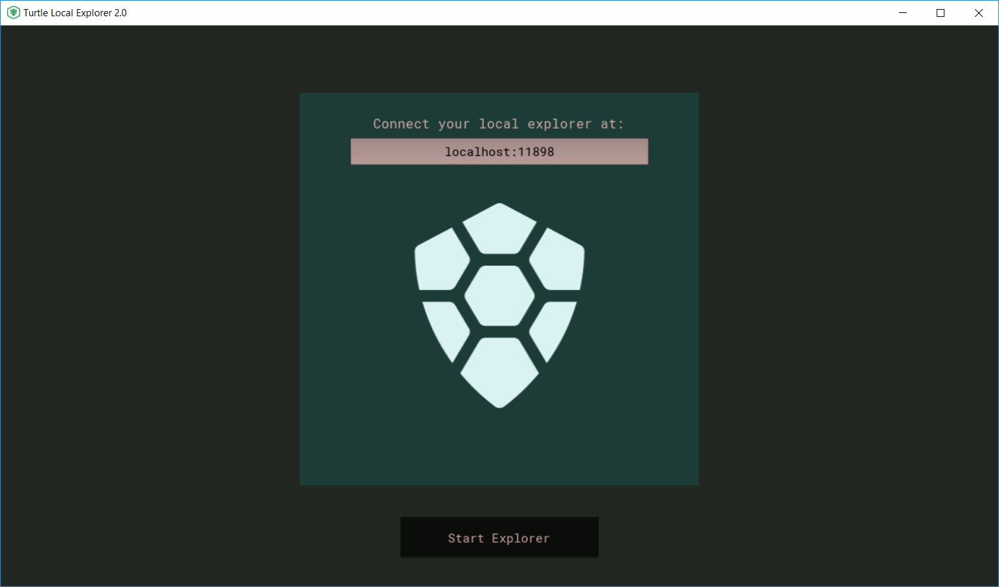

# Local-Turtle-Explorer 2.0

This 2.0 version uses kivy for its GUI.

The choice of Kivy is just a personal adventure which I wanted to make something out of it.

If you find any issue or have a request or suggestion please submit a new issue in the github repo.

## Overview

Once you open the local explorer, it will take you to the start screen.

Simply click start to start the program.

[Turtlecoin Repository](https://github.com/turtlecoin/turtle-explorer-desktop)
[Sabo (Revolutionary)](https://github.com/yumingchangsabodota)
