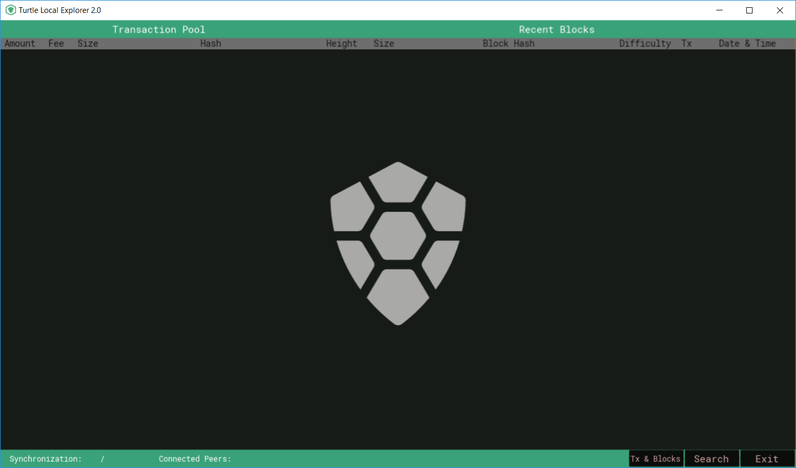
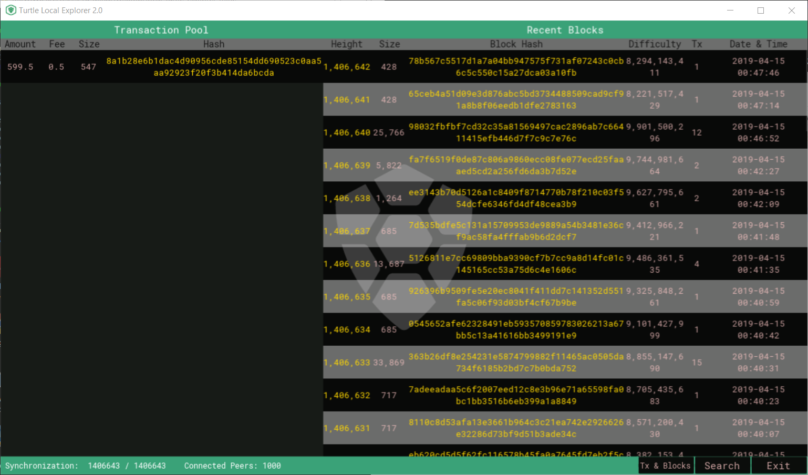
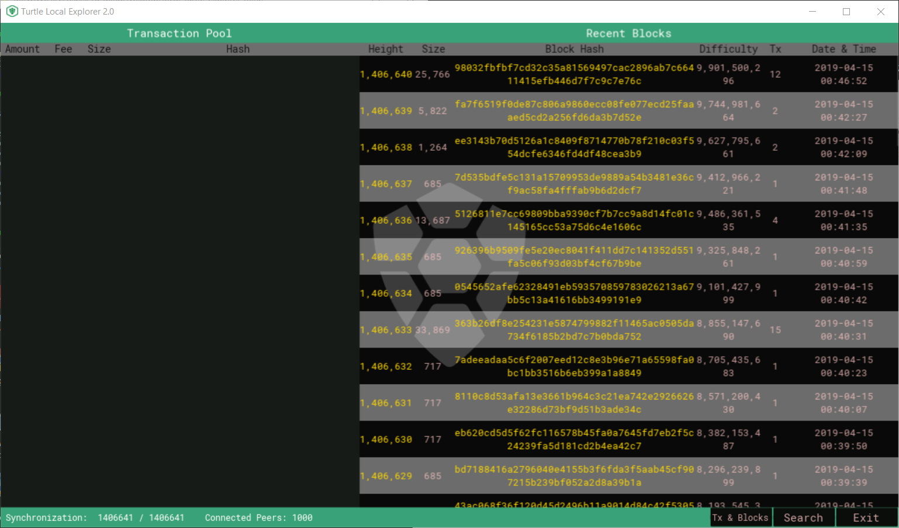
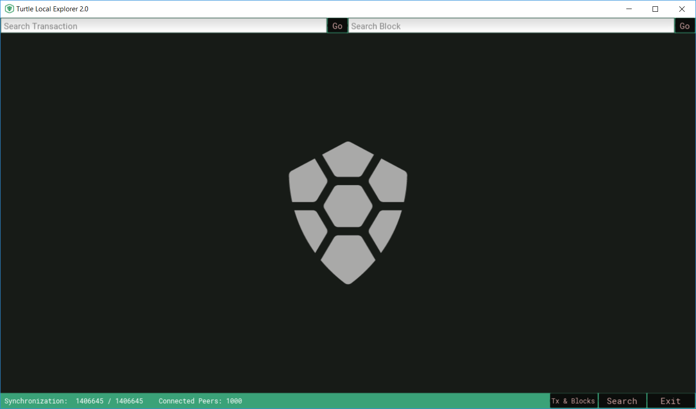
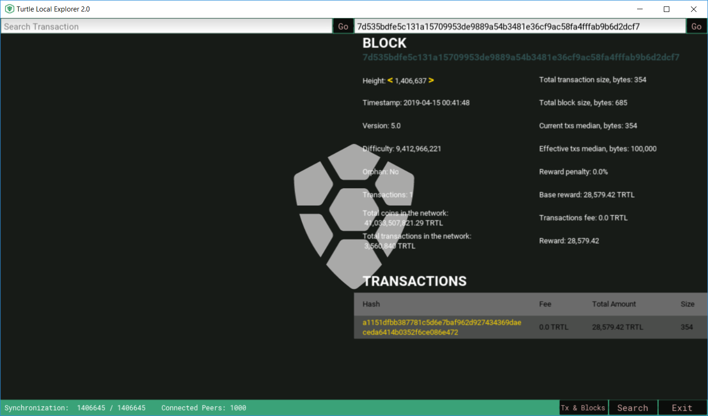
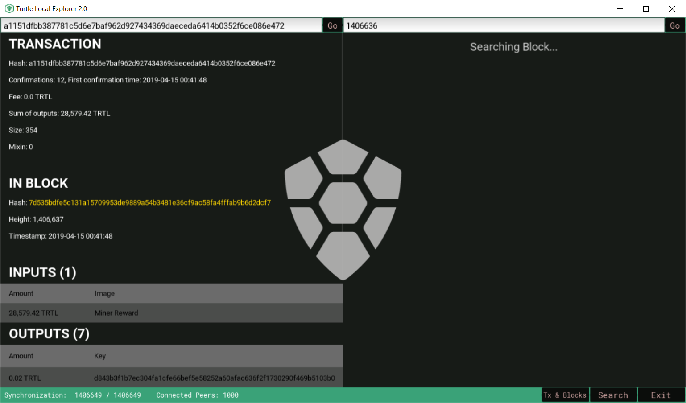
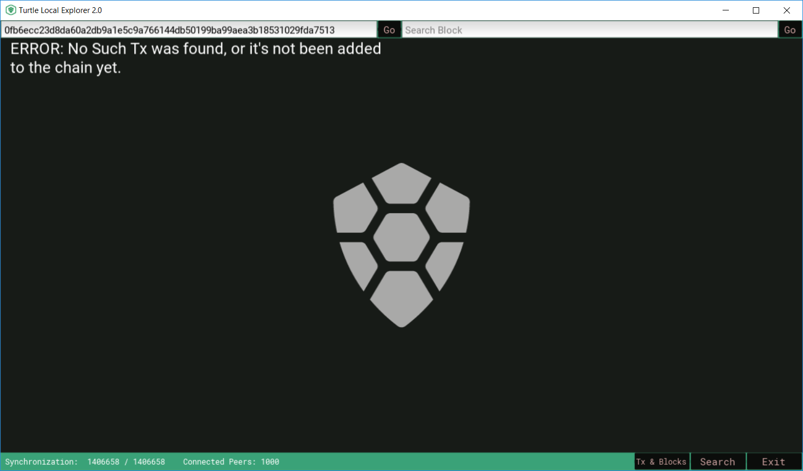

# Local-Turtle-Explorer 2.0

This 2.0 version uses kivy for its GUI.

The choice of Kivy is just a personal adventure which I wanted to make something out of it.

If you find any issue or have a request or suggestion please submit a new issue in the github repo.

## Overview

Once you open the local explorer, it will take you to the start screen.

Your TurtleCoind daemon is set to your local host at prot 11898.

Simply click *Start Explorer* to start the program.

### Transaction Pool and Recent Blocks

When you start the explorer, the screen is going to jump to the *Tx pool and recent blocks* screen.

Notice that there is nothing showing on the screen because the program just started and is still synching.

Give it sometime and things will start showing up.

Once the program is fully synched you can see the recent blocks and transaction pool.

Sometimes the tx pool is empty. 

It is normal because there might not always be a pending transaction in the network.

### Search

Click search at the buttom and it will take you to the search screen.

Just enter the hash or block height and you can begin to search.

Search for block

Search for transaction

If you provide a invalid hash or height you will get an error

#### Note: *the yellow texts in the program are clickable. Once clicked, it will search the transaction or block for you accordingly. This includes the texts in the transaction pool and recent block screen.*

##### Credits to:

[Turtlecoin](https://github.com/turtlecoin)

[Kivy](https://kivy.org/#home)

##### Find Turtle Local Explorer in Turtlecoin repo:

[turtle-explorer-desktop](https://github.com/turtlecoin/turtle-explorer-desktop)

##### My Repo:

[Sabo (Revolutionary)](https://github.com/yumingchangsabodota)
